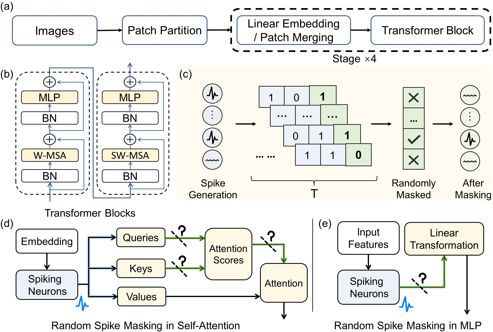

## Masked Spiking Transformer (ICCV-2023)

### *checkpoints will be released soon!*

### Abstract
The combination of Spiking Neural Networks (SNNs) and Transformers has attracted significant attention due to their potential for high energy efficiency and high-performance nature. However, **there still remains a considerable challenge to achieving performance comparable to artificial neural networks in real-world applications** .
Besides, **the mainstream method for ANN-to-SNN conversion trade increased simulation time and power for high-performance SNN, and generally consumes lots of computational resources when making inference**.

To address this issue, we propose an energy-efficient architecture, **the Masked Spiking Transformer, that combines the benefits of SNNs and the high-performance self-attention mechanism in Transformer utilizing the ANN-to-SNN conversion methods**. Furthermomre, our method, called R**andom Spike Masking, prunes input spikes during both training and inference to reduce SNN computational costs**. 

The Masked Spiking Transformer combines the self-attention mechanism and the ANN-to-SNN conversion method, achieving state-of-the-art accuracy on both static and neuromorphic datasets. Experimental results demonstrate the RSM method reduces redundant spike operations while keeping model performance over a certain range of mask rates across various model architectures. For instance, the RSM method reduces MST model power by 26.8% at a 75% mask rate with no performance drop. 

<br/>



The paper is available at [ICCV-23](https://openaccess.thecvf.com/content/ICCV2023/html/Wang_Masked_Spiking_Transformer_ICCV_2023_paper.html). 
### Running the Code

#### 1. Pre-training ANN MST with QCFS function on ImageNet with multiple GPUs:
```bash
python -m torch.distributed.launch --nproc_per_node 8 main.py --cfg configs/mst/MST.yaml --batch-size 128
```

#### 2. SNN Validation:
```bash
python -m torch.distributed.launch --nproc_per_node 8 main.py --cfg configs/mst/MST.yaml --batch-size 128 --snnvalidate True --sim_len 128
```
- `--sim_len`: timestep of SNN.
- `--snnvalidate`: enalbes SNN validation.

